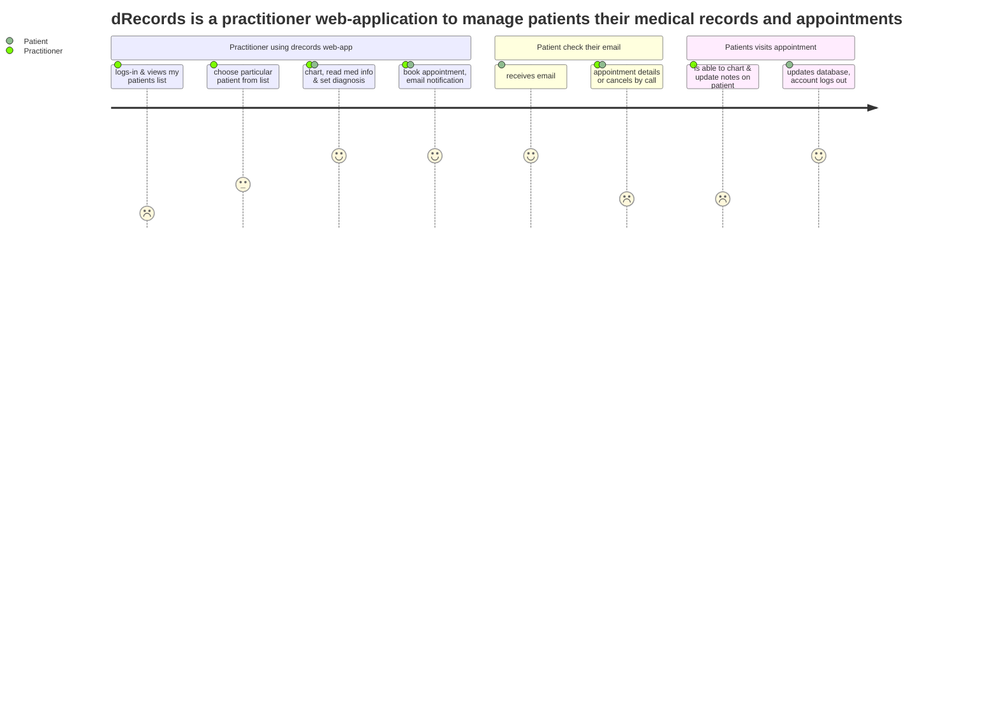

# dRecords

**Project Description**
An online charting application allowing healthcare providers to access patient information and schedule follow-up appointments efficiently. The user can keep track of old entries and register new ones upon a change in the patient's condition. An integrated calendar allows the user to plan tasks and keep track of upcoming events.

**Problem solved** 
Currently, there are few universal tools that allow for charting, diagnosis, medical history, and appointment all on one platform, which leads to greater effort on practitioner and time consumption. 

As a previous healthcare provider, I believe that to solve the inefficiencies there should be a uniform portal allowing for all of these procedures to happen in one place. 

This projects’ value proposition is to allow the practitioner to perform all these functions resulting in a greater time savings and convenience, freeing up their time to allow for actual healthcare rather than administrative duties. 


**Target audience:** Healthcare providers looking for an effective way of documenting their diagnosis and notes as well as keeping track of patients.

## User Diagram with Mermaid


##Dependencies 
1. Frontend: React, Material-UI, Bootstrap, Kalend (https://docs.kalend.org/docs/intro), SASS
2. Backend: Node.js , Express, Send-grid Mail API
3. Database: Postgres


##Set Up 
1. Install Front-End dependencies with ```npm install``` in the client folder 
2. Install Back-End dependencies with ```npm install``` in the server folder
3. Set Up psql by creating a new database and coming the .env.example file in the .env file 
4. In order to be able to send an email after an appointment is created, create a API KEY with SendGrid (https://sendgrid.com/) and add it to .env file

##Pictures 


